

# Unity Support for ReSharper and Rider

The "Unity Support" plugin adds specific functionality for the [Unity game engine](http://unity3d.com/) to [ReSharper](https://www.jetbrains.com/resharper/) and [Rider](https://www.jetbrains.com/rider/).

Rider is JetBrains' cross platform .NET IDE, based on ReSharper and the IntelliJ Platform. It can be used on Windows, Mac and Linux and this plugin can replace the default MonoDevelop editor with an IDE providing rich code navigation, inspections and refactorings.

The plugin adds code completion and generation of Unity event functions, inspections for common errors, quick fixes, support for `.shader` files, automatic handling of `.meta` files and more. The Rider plugin includes additional support for attaching the debugger to the Editor instance and a Unity Editor plugin to improve integration.

## Installation 2019.2+ with Rider package

In Unity just setting External Editor to Rider should be enough.

## Installation 2019.1-

This plugin comes bundled with Rider, and manual installation is not required. However, it is necessary to configure Unity to use Rider as the external script editor:

* Check if `.sln` file is present:  
    - Start Rider and open the `.sln` file. Rider will install a Unity Editor plugin into the project ([see below for more details](#unity-editor-plugin))
    - Otherwise, start Rider and open project folder in Rider. Rider will show Notification, which allows to install Unity Editor plugin. 
* Switch back to the Unity Editor, with the same Unity project open. The new Unity Editor plugin will automatically configure Rider as the external script editor.

This only needs to be done once, and can also be done manually, via the Unity Editor's _External Editor_ Preference pane.

Double clicking on C# scripts and `.shader` files will now automatically open Rider, load the solution and navigate to the file. More file types can be associated with Rider by editing _Additional extensions_ in the _Edit &rarr; Project Settings &rarr; Editor_ settings pane.

The solution can be loaded directly with the _Assets &rarr; Open C# Project_ menu item.

> Note that Rider will add an _Assets &rarr; Open C# Project in Rider_ menu item for older versions of Unity. This is because prior to 2017.1, the Unity Editor doesn't recognise Rider as an editor that can load C# solutions, and will also launch MonoDevelop. Other than not launching MonoDevelop, these menu items are identical.

Rider will install the Unity Editor plugin in each Unity project it opens. [See below for more details](#unity-editor-plugin).

The ReSharper plugin is installed via the _ReSharper &rarr; Extension Manager_. Simply search for "Unity Support".

## Features

**Unity API knowledge:**

* The plugin knows about all Unity based classes (`MonoBehaviour`, `ScriptableObject`, `EditorWindow`, etc.) and their event functions via analysis of the Unity API surface and documentation.
* Support for Unity API starting from 5.0.

**Event functions:**

* [Event functions](https://docs.unity3d.com/Manual/EventFunctions.html) and fields implicitly used by Unity are marked with an icon in the gutter.
* Empty event functions are marked as dead code, with a Quick Fix to remove the method.
* When [Solution Wide Analysis](https://www.jetbrains.com/help/resharper/2016.2/Code_Analysis__Solution-Wide_Analysis.html) is enabled, implicitly used fields and event functions are marked as in use. Fields are highlighted if they aren't accessed in your code.

  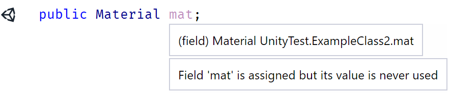

* A new "Generate Unity event function" menu item is added to the <kbd>Alt</kbd>+<kbd>Insert</kbd> Generate Code menu, to generate event functions via GUI. This action is also available from <kbd>Alt</kbd>+<kbd>Enter</kbd> on a Unity based class's name.

    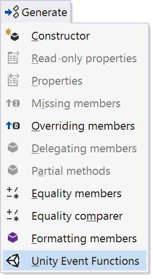

    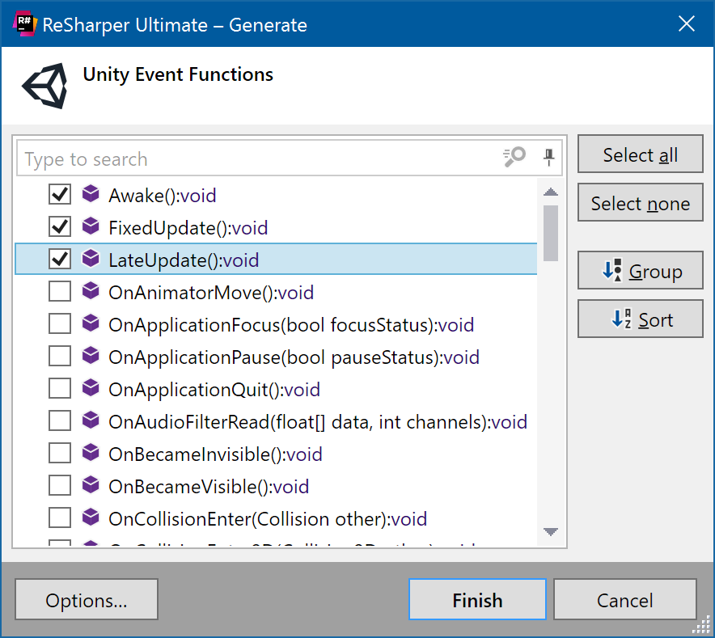

* Auto complete will suggest event function names when declaring methods in Unity based classes, and expand to include method signature. Simply start typing an event function within a class deriving from a known Unity class, such as `MonoBehaviour`.

  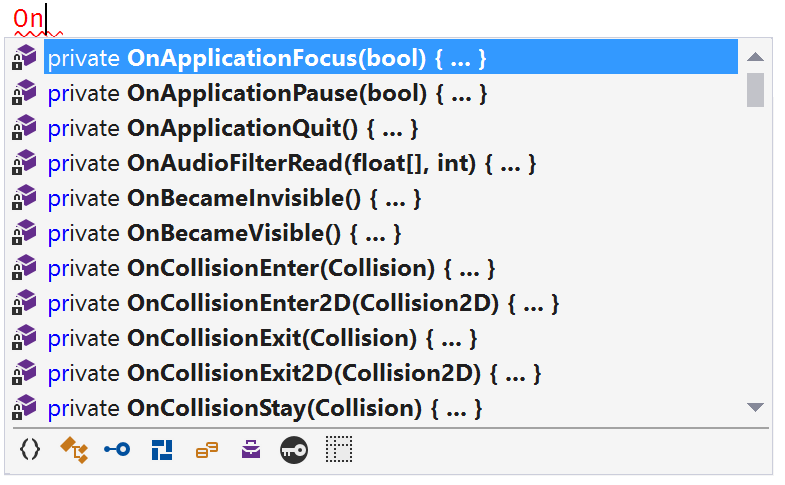

* Incorrect method signatures and return types are shown as warnings, with a Quick Fix to create the correct signature.
* Optional parameters are called out in a tooltip, and marked as unused if not used in the body of the method, e.g. `OnCollisionEnter(Collision collision)`.
* Suppress naming consistency warnings for known Unity event functions. E.g. ReSharper no longer suggests that `AnimatorIK` be renamed to `AnimatorIk`.
* Descriptions for event functions and parameters in Unity based classes are shown in tooltips and [QuickDoc](https://www.jetbrains.com/help/resharper/2016.2/Coding_Assistance__Quick_Documentation.html). To show the information in tooltips, ReSharper's "Colour identifiers" and "Replace Visual Studio tooltips" setting must be enabled (search for them in settings). Alternatively, use the excellent [Enhanced Tooltip](https://github.com/MrJul/ReSharper.EnhancedTooltip#readme) plugin.

  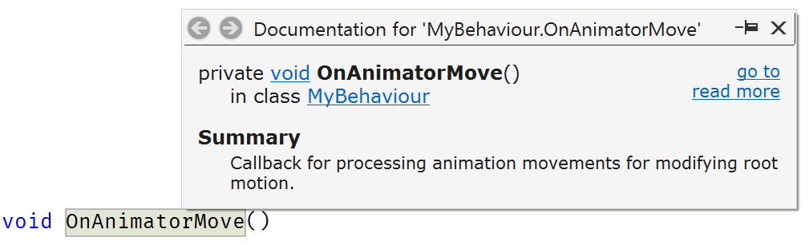

* "Read more" in [QuickDoc](https://www.jetbrains.com/help/resharper/2016.2/Coding_Assistance__Quick_Documentation.html) will navigate to the Unity API documentation, locally if available, or via the Unity website.

**Coroutines and invokable methods:**

* Event functions that can be coroutines are called out in tooltips.
* Context Action on methods that can be coroutines to convert method signature to/from coroutine.
* Warnings for unused coroutine return values.
* Code completion, find usages and rename support for string literals in `MonoBehaviour.Invoke`, `IsInvoking`, `InvokeRepeating` and `CancelInvoke`. Also supports `StartCoroutine` and `StopCoroutine` and understands overloads here.

  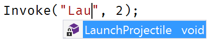

**Networking:**

* Code completion, find usages and rename support for string literals in `[SyncVar(hook = "OnValueChanged")]`.
* Highlight usage of `SyncVarAttribute` in any class other than `NetworkBehaviour` as an error.

**Inspections and Quick Fixes:**

* Empty event functions are shown as dead code, with a quick fix to remove the method.
* Using the `SyncVarAttribute` inside any class other than `NetworkBehaviour` is treated as an error.
* Inspection and Quick Fix to use `CompareTag` instead of string comparison.

  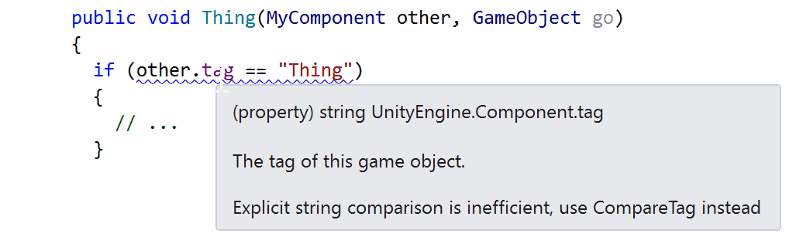

* "Create serialized field" from usage of unresolved symbol.

  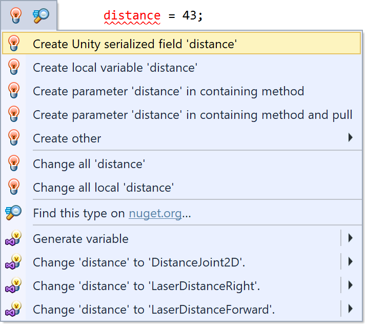

* Inspections and Quick Fixes for incorrect event function signatures and return types.

  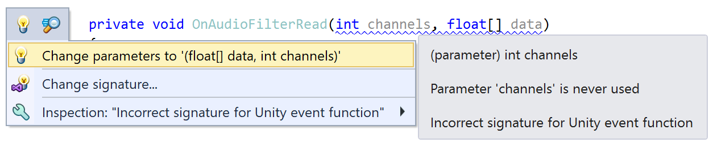

* Inspections and Quick Fixes for incorrect method or static constructor signatures for `InitializeOnLoad` attributes.
* Inspections for incorrectly calling `new` on a `MonoBehaviour` or `ScriptableObject`. Quick Fixes will convert to calls to `GameObject.AddComponent<T>()` and `ScriptableObject.CreateInstance<T>()`.
* Inspection for unused coroutine return value.

**ShaderLab support:**

Initial support for [ShaderLab](https://docs.unity3d.com/Manual/SL-Shader.html) syntax in `.shader` files, with limited support for Cg/HLSL blocks.

ShaderLab:

* Syntax and syntax error highlighting for ShaderLab syntax.

  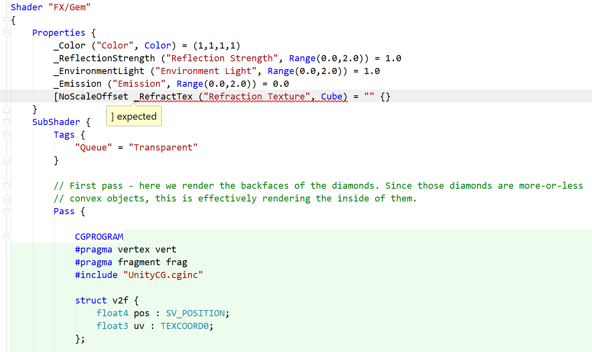

* Colours highlighting and editing.

  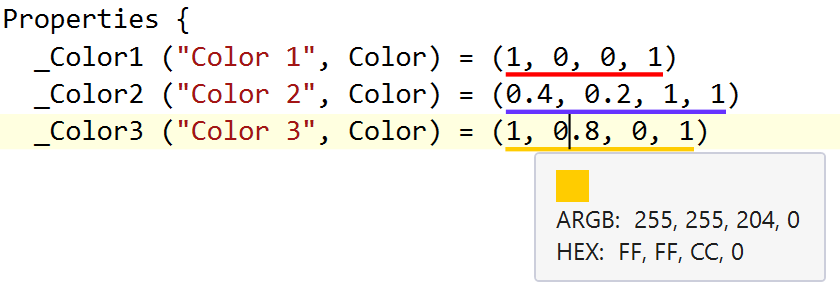

  Also available in Rider:

  

* Rider includes simple word based completion (so called ["hippie completion"](https://www.jetbrains.com/help/idea/auto-completing-code.html#hippie_completion)). This provides completion based on words found in the current file. This is not available in ReSharper.

  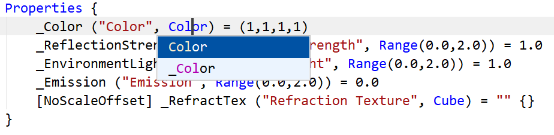

* Brace matching and highlighting, comment/uncomment, and to-do explorer support.

  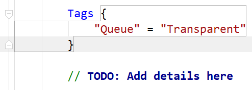

* Code folding in Rider.

  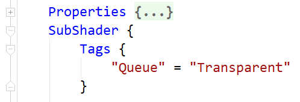

Cg/HLSL (Rider only):

* Syntax highlighting for `CGPROGRAM`/`CGINCLUDE` blocks and `.cginc` files. Currently no syntax error highlighting.
* Simple word based completion (so called ["hippie completion"](https://www.jetbrains.com/help/idea/auto-completing-code.html#hippie_completion)).

  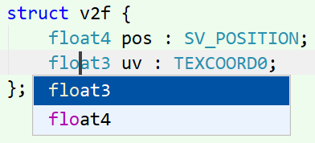

**External Annotations:**

See the ReSharper help for [more details on External Annotations](https://www.jetbrains.com/help/resharper/2016.2/Code_Analysis__External_Annotations.html).

* Treat code marked with attributes from UnityEngine.dll, UnityEngine.Networking.dll and UnityEditor.dll as implicitly used.
* Mark `Component.gameObject` and `Object.name` as not-nullable.
* `Debug.Assert` marked as assertion method to help null-value analysis (e.g. "value cannot be null" after `Debug.Assert(x != null)`)
* `Debug.AssertFormat`, `LogFormat`, etc. gets string formatting helper functionality.
* `Assertions.Assert` methods marked as assertion methods to help null-value analysis.
* `EditorTestsWithLogParser.ExpectLogLineRegex` gets regular expression helper functionality.
* Various attributes now require the class they are applied to derive from a specific base type. E.g. `[CustomEditor]` requires a base class of `Editor`).
* Support for Unity 2017.2's modularised UnityEngine assemblies.

**Project and File Templates:**

* Project template Unity Class Library *

  Essentially it is a Class Library with reference to UnityEngine.dll 

* File templates for new C# script, tests and shader files.

  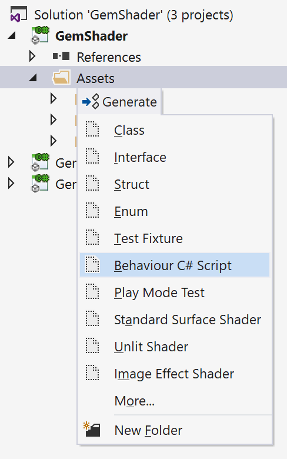

  Also available in Rider:

  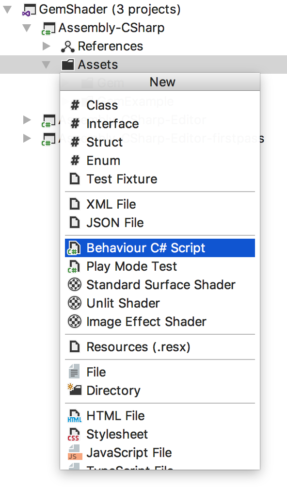

* Support for editing and creating File Templates and Live Templates for Unity projects in ReSharper. Note that Rider currently doesn't support editing File and Live Templates. This is planned for Rider 2017.3)

**Other:**

* Synchronise .meta files on creation, deletion, rename and refactoring.
* Automatically sets correct C# language version, if not already specified in .csproj - ReSharper will no longer suggest code fixes that won't compile! Supports the default C# 4 compiler, Unity 5.5's optional C# 6 compiler and the C# 6/7.0 compiler in the [CSharp60Support](https://bitbucket.org/alexzzzz/unity-c-5.0-and-6.0-integration/src) plugin.
* Disables the `Assets` and `Assets\Scripts` folders from being considered as ["namespace providers"](https://www.jetbrains.com/help/resharper/2016.2/CheckNamespace.html). This means ReSharper will no longer suggest to include `Assets` or `Scripts` in the namespace of your code.
* Support for `UnityEngine.Color` and `UnityEngine.Color32`. The colour is highlighted, and hitting <kbd>Alt</kbd>+<kbd>Enter</kbd> will open the colour palette editor to modify the colour. Also supports named colours and `Color.HSVToRGB`.

  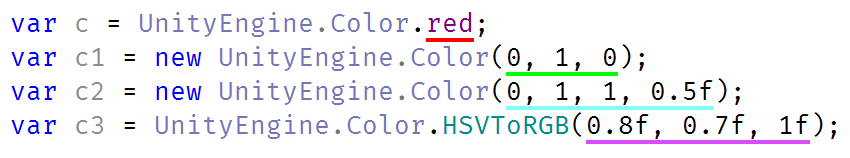

### Rider specific functionality

The plugin also adds some functionality just for Rider:

* The `Library` and `Temp` folders are automatically excluded from Rider's full text search, used for the "Find in Path" feature. These folders can become very large, and can take a long time to index if not excluded.
* Rider will automatically create an "Attach to Unity Editor" run configuration. When the debug button is clicked, Rider will automatically attach to the editor and start debugging. Rider will look for a `Library/EditorInstance.json` file, created by Unity 2017.1, or by [EditorPlugin](https://github.com/JetBrains/resharper-unity/tree/master/unity). If the file doesn't exist and only a single instance of Unity is running, Rider will attach to this instance. If multiple instances are running, Rider will prompt for which instance to attach to.

  

* Rider will install a Unity Editor plugin whenever a Unity project is opened. [See below for more details](#unity-editor-plugin).

Please [suggest new features in the issues](https://github.com/JetBrains/resharper-unity/issues)!

## Unity Editor plugin

> For `Unity 2019.2+ with Rider package` Editor plugin is loaded directly from Rider installation. 

By default, when Rider opens a Unity project, it will automatically install a Unity Editor plugin, and keep it up to date with new versions. This behaviour can be disabled in Rider's _Preferences &rarr; Languages &amp; Frameworks &rarr; Unity Engine_.

This plugin does the following:

* Automatically set Rider as the default external script editor.
* Ensure the C# solution and project files are up to date, and make minor changes required by Rider:
    * Attempts to set appropriate `TargetFrameworkVersion`. This is customizable in _Preferences_. Note that this affects how Rider resolves references, and does not change how Unity builds a project.
    * Set the `LangVersion` correctly, so that Rider does not suggest C# 6 features when Unity is targeting C# 4, or C# 7 features when Unity is targeting C# 6.
    * Add references to `UnityEditor.iOS.Extensions.Xcode.dll` and `UnityEditor.iOS.Extensions.Common.dll`, which are referenced when Unity builds, but not included in the generated project files. [See this GitHub issue for more details](https://github.com/JetBrains/Unity3dRider/issues/15).
    * Add options defined in `mcs.rsp` or `smcs.rsp` and `gmcs.rsp` files, such as conditional compilation defines, the `unsafe` keyword and [references(https://github.com/JetBrains/resharper-unity/issues/270)]. Adding them to the project file makes the information available to Rider's analysis.
* Use interprocess communication to speed up opening C# scripts, `.shader` files and text assets in Rider, if it's already running. It will launch Rider and load the solution if it isn't.
* Add a _Rider_ Preference pane:
    * Enable logging to the console for troubleshooting. Please use this before logging an issue.
    * Customize `TargetFrameworkVersion` for generated project files. Note that this only affects how Rider resolves references, and does not change how Unity builds a project.
* Provide extra functionality for older versions of the Unity Editor (prior to Unity 2017.1):
    * Create a file called `Library/EditorInstance.json` that contains process information for debugging the Unity Editor. This file is created natively by Unity since 2017.1.
    * Add an _Assets &rarr; Open C# Project in Rider_ menu item. Earlier versions of Unity do not recognise Rider as an editor that can correctly open solutions, and so will launch both Rider and MonoDevelop when the _Assets &rarr; Open C# Project_ menu item is selected.

Rider will automatically add this plugin to all Unity projects that are opened. It will initially install the plugin to `Assets/Plugins/Editor/JetBrains/JetBrains.Rider.Unity.Editor.Plugin.Repacked.dll`, but will look for the file by name if it is moved.

Supported Unity versions: 5.0+

## Roadmap

Check the [milestones](https://github.com/JetBrains/resharper-unity/milestones) for plans, and please [raise an issue](https://github.com/JetBrains/resharper-unity/issues) with feature requests or bugs.
