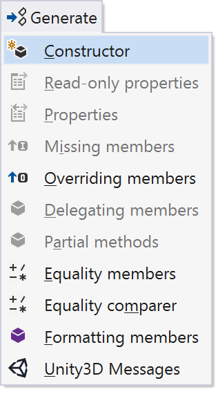

# Unity for ReSharper

This plugin adds support for [Unity](http://unity3d.com/) to ReSharper.

Current features:

* ReSharper knows about all Unity based classes (`MonoBehaviour`, `ScriptableObject`, `EditorWindow`, etc.) via analysis of the Unity API surface and documentation.
* Methods and fields implicitly used by Unity are no longer marked as unused by ReSharper.
* <kbd>Alt</kbd>+<kbd>Insert</kbd> on Unity based classes to generate message handler methods via GUI.

    

* Auto complete will suggest message handler names when declaring methods in Unity based classes.

    

* Descriptions for message handler methods and parameters in Unity based classes are shown in tooltips and QuickDoc. To show the items in tooltips, ReSharper's "Colour identifiers" and "Replace Visual Studio tooltips" setting must be enabled (search for them in settings). Alternatively, use the excellent [Enhanced Tooltip](https://github.com/MrJul/ReSharper.EnhancedTooltip#readme) plugin.

    

* "Read more" in QuickDoc will navigate to the Unity API documentation, locally if available, or via the Unity website.
* Code completion, find usages and rename support for string literals in `MonoBehaviour.Invoke`, `InvokeRepeating` and `CancelInvoke`.

    

* Suppress naming consistency warnings for known Unity message handlers. E.g. RSharper no longer suggests that `AnimatorIK` be renamed to `AnimatorIk`.
* Disables the `Assets` and `Assets\Scripts` from being considered as "namespace providers". This means ReSharper will no longer suggest to include `Assets` or `Scripts` in the namespace of your code.
* Automatically sets Unity projects to be C# 5 only. The Unity compiler is only C# 5, so no more incompatible C# 6 suggestions!

Please feel free to [suggest new features in the issues](https://github.com/JetBrains/resharper-unity/issues)!

## Installing

Use ReSharper's Extension Manager (ReSharper &rarr; Extension Manager), search for "Unity" and install. Restart, and it'll just start working.

Please watch the repo or follow [@citizenmatt](https://twitter.com/citizenmatt) and [@slavikt](https://twitter.com/slavikt) on twitter for updates.

## Roadmap

There is no roadmap as such. I am not a Unity developer, so do not know what the common pain points are. If you'd like to suggest a feature, please [raise an issue](https://github.com/JetBrains/resharper-unity/issues).
